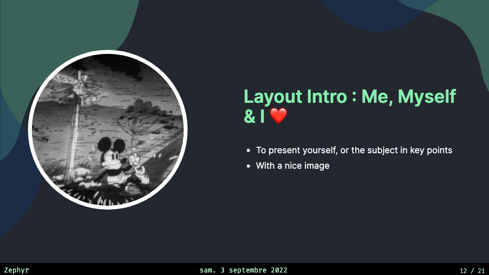

# slidev-theme-ventus-sandbox

[](https://www.npmjs.com/package/slidev-theme-ventus-sandbox)

A (...) theme for [Slidev](https://github.com/slidevjs/slidev).

<!--
  Learn more about how to write a theme:
  https://sli.dev/themes/write-a-theme.html
--->

<!--
  run `npm run dev` to check out the slides for more details of how to start writing a theme
-->

<!--
  Put some screenshots here to demonstrate your theme

  Live demo: [...]
-->

## Install

Add the following frontmatter to your `slides.md`. Start Slidev then it will prompt you to install the theme automatically.

<pre><code>---
theme: <b>ventus</b>
---</code></pre>

Learn more about [how to use a theme](https://sli.dev/themes/use).

## Layouts

This theme provides the following layouts:

> TODO:

## Components

This theme provides the following components:

> TODO:

## Contributing

- `npm install`
- `npm run dev` to start theme preview of `example.md`
- Edit the `example.md` and style to see the changes
- `npm run export` to generate the preview PDF
- `npm run screenshot` to generate the preview PNG


A Tornado 🌪 theme for [Slidev](https://github.com/slidevjs/slidev).

Live demo: [here](https://stephane-pires.github.io/ventus-sandbox)

## Install

Add the following frontmatter to your `slides.md`. Start Slidev then it will prompt you to install the theme automatically.

<pre><code>---
theme: <b>ventus</b>
---</code></pre>

Learn more about [how to use a theme](https://sli.dev/themes/use).

## Layouts

This theme provides the following layouts:

### Footer

But you can add this properties to add header and footer

```
---
// at the frontmatter
  presenterName: "name-of-the-presenter" 
  dateFormat: "en-US" (note : link to the list of dateFormat)
---
```


### Intro `intro`

Usage:

- Add `cover` in the layout field.

```
---
layout: cover
---
```

Dark                       | Light
:-------------------------:|:-------------------------:
 | 

---

### Presenter `presenter`

Usage:

- Add `intro` in the layout field.
- Add `introImage` for the speaker image.

```
---
layout: intro
presenterImage: './my-presenter-image.png'
---
```

Dark                       | Light
:-------------------------:|:-------------------------:
 | 

---

### Section `section`

Usage:

- Add `section` in the layout field.
- Add `number` to give a number to the section.

```
---
layout: section
number: 1
---
```

Dark                       | Light
:-------------------------:|:-------------------------:
 | 

---


### Code `code`

Usage:

- Add `code` in the layout
- Can't be used with a title

```
---
layout: code
---
```

Dark                       | Light
:-------------------------:|:-------------------------:
 | 
 | 

### Default `default`

Usage:

- Layout by defaults

Dark                       | Light
:-------------------------:|:-------------------------:
 | 


### End `end`

Usage:

- Add `end` in the layout
- You can end your presentation with this slide


```
---
layout: end
---
```

Dark                       | Light
:-------------------------:|:-------------------------:
 | 


### Feedback `feedback`

#### Goal : 

- Use to make a "pause" in your presentation and get feedback from the attendees

#### Usage:

- Add `feedback` in the layout


```
---
layout: feedback
---
```

Dark                       | Light
:-------------------------:|:-------------------------:
 | 

### Iframe-left or Iframe-right `iframe-left`

#### Goal : 

- Use to visualize iframe while showing something else (text, image, code, etc..)

#### Usage:

- Add `iframe-left` or `iframe-right` in the layout

```
---
layout: iframe-left
---
```

Dark                       | Light
:-------------------------:|:-------------------------:
 | 


### Image-left or Image-right `image-left`

#### Goal : 

- Use to visualize image while showing something else (text, image, code, etc..)

#### Usage:

- Add `image-left` or `image-right` in the layout

```
---
layout: image-right
---
```

Dark                       | Light
:-------------------------:|:-------------------------:
 | 


### Punch `punch`

#### Goal : 

- Use to make the audience wake-up.
- Use when you want to show something that stand out from the rest of the presentation

#### Usage:

- Add `punch` in the layout

```
---
layout: punch
---
```

Dark                       | Light
:-------------------------:|:-------------------------:
 | 


### Quote `quote`

#### Goal : 

- Use when you quote someone.


#### Usage:

- Add `quote` in the layout

```
---
layout: quote
---
```

Dark                       | Light
:-------------------------:|:-------------------------:
 | 


### ROTI `roti`

#### Goal : 

- Use when you want feedback [roti method](https://www.lucidmeetings.com/glossary/roti#:~:text=ROTI%20stands%20for%20Return%20on,an%20excellent%20use%20of%20time.) from 1 to 5


#### Usage:

- Add `roti` in the layout

```
---
layout: roti
---
```

Dark                       | Light
:-------------------------:|:-------------------------:
 | 


## Components

This theme provides the following components:

### Auto-favicon fancy link `fancy-link`

`FancyLink` Component will allow you to automatically add the favicon just aside your link.


To use it you just need to add it to your `examples.md` like this:

```markdown
Say hi at <fancy-link href="https://twitter.com/alvarosabu">@alvarosabu</fancy-link>
```

### Console window `the-console`


```ts
<the-console>
  <iframe height="300" style="width: 100%;" scrolling="no" title="Text Clock" src="https://codepen.io/searleb/embed/pvQaJB?default-tab=html%2Cresult" frameborder="no" loading="lazy" allowtransparency="true" allowfullscreen="true">
    See the Pen <a href="https://codepen.io/searleb/pen/pvQaJB">
    Text Clock</a> by Bill Searle (<a href="https://codepen.io/searleb">@searleb</a>)
    on <a href="https://codepen.io">CodePen</a>.
  </iframe>
</the-console>s
```


> TODO:

## Contributing

- `npm install`
- `npm run dev` to start theme preview of `example.md`
- Edit the `example.md` and style to see the changes
- `npm run export` to generate the preview PDF
- `npm run screenshot` to generate the preview PNG