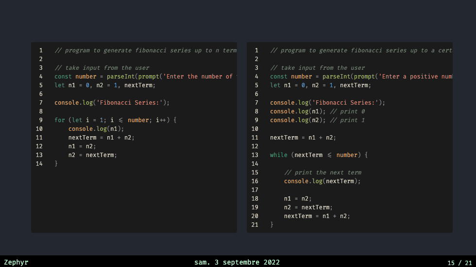

# slidev-theme-ventus-sandbox

[](https://www.npmjs.com/package/slidev-theme-ventus-sandbox)

A Tornado 🌪 theme for [Slidev](https://github.com/slidevjs/slidev).

Live demo: [here](https://stephane-pires.github.io/ventus-sandbox)
<!--
  Learn more about how to write a theme:
  https://sli.dev/themes/write-a-theme.html
--->

<!--
  run `npm run dev` to check out the slides for more details of how to start writing a theme
-->

<!--
  Put some screenshots here to demonstrate your theme

  Live demo: [...]
-->

## Install

Add the following frontmatter to your `slides.md`. Start Slidev then it will prompt you to install the theme automatically.

<pre><code>---
theme: <b>ventus</b>
---</code></pre>

Learn more about [how to use a theme](https://sli.dev/themes/use).

## Layouts

This theme provides the following layouts:

### Footer

You can configure the presenter name and language used to format the date by configuring thoses `props` at the frontmatter

```markdown
---
// at the frontmatter
  presenterName: "name-of-the-presenter" 
  dateFormat: "en-US" (note : link to the list of dateFormat)
---
```


### Intro : `intro`

Usage:

- Add `cover` in the layout field.

```
---
layout: cover
---
```

Dark                       | Light
:-------------------------:|:-------------------------:
 | 

---

### Presenter : `presenter`

Usage:

- Add `intro` in the layout field.
- Add `introImage` for the speaker image.

```
---
layout: intro
presenterImage: './my-presenter-image.png'
---
```

Dark                       | Light
:-------------------------:|:-------------------------:
 | 

---

### Section : `section`

Usage:

- Add `section` in the layout field.
- Add `number` to give a number to the section.

```
---
layout: section
number: 1
---
```

Dark                       | Light
:-------------------------:|:-------------------------:
 | 

---


### Code : `code`

Usage:

- Add `code` in the layout
- Can't be used with a title

```
---
layout: code
---
```

Dark                       | Light
:-------------------------:|:-------------------------:
 | 
 | 

### Default : `default`

Usage:

- Layout by defaults

Dark                       | Light
:-------------------------:|:-------------------------:
 | 


### End : `end`

Usage:

- Add `end` in the layout
- You can end your presentation with this slide


```
---
layout: end
---
```

Dark                       | Light
:-------------------------:|:-------------------------:
 | 


### Feedback : `feedback`

#### Goal : 

- Use to make a "pause" in your presentation and get feedback from the attendees

#### Usage:

- Add `feedback` in the layout


```
---
layout: feedback
---
```

Dark                       | Light
:-------------------------:|:-------------------------:
 | 

### Iframe-left or Iframe-right : `iframe-left`

#### Goal : 

- Use to visualize iframe while showing something else (text, image, code, etc..)

#### Usage:

- Add `iframe-left` or `iframe-right` in the layout

```
---
layout: iframe-left
---
```

Dark                       | Light
:-------------------------:|:-------------------------:
 | 


### Image-left or Image-right : `image-left`

#### Goal : 

- Use to visualize image while showing something else (text, image, code, etc..)

#### Usage:

- Add `image-left` or `image-right` in the layout

```
---
layout: image-right
---
```

Dark                       | Light
:-------------------------:|:-------------------------:
 | 


### Punch : `punch`

#### Goal : 

- Use to make the audience wake-up.
- Use when you want to show something that stand out from the rest of the presentation

#### Usage:

- Add `punch` in the layout

```
---
layout: punch
---
```

Dark                       | Light
:-------------------------:|:-------------------------:
 | 


### Quote : `quote`

#### Goal : 

- Use when you quote someone.


#### Usage:

- Add `quote` in the layout

```
---
layout: quote
---
```

Dark                       | Light
:-------------------------:|:-------------------------:
 | 


### ROTI : `roti`

#### Goal : 

- Use when you want feedback [roti method](https://www.lucidmeetings.com/glossary/roti#:~:text=ROTI%20stands%20for%20Return%20on,an%20excellent%20use%20of%20time.) from 1 to 5


#### Usage:

- Add `roti` in the layout

```
---
layout: roti
---
```

Dark                       | Light
:-------------------------:|:-------------------------:
 | 


## Components

This theme provides the following components:

### Text `<Text> ... </Text>`

#### Goal :

  `<Text>` Component will allow you to automatically format some text.

#### Usage :

To use it you just need to add it to your `slides` like this:

```markdown
<Text>"Lorem ipsum dolor sit amet, consectetur adipiscing elit, sed do eiusmod tempor incididunt ut labore et dolore magna aliqua. Ut enim ad minim veniam, quis nostrud exercitation ullamco laboris nisi ut aliquip ex ea commodo consequat. Duis aute irure dolor in reprehenderit in voluptate velit esse cillum dolore eu fugiat nulla pariatur. Excepteur sint occaecat cupidatat non proident, sunt in culpa qui officia deserunt mollit anim id est laborum."</Text>
```

### Variant  `<Variant> ... </Variant>`

#### Goal : 

`<Variant>` give you the ability to style the color of a text

#### Usage : 

To use it you just need to add it to your `slides` like this:

```markdown
<Variant type='highlight'>
  Some text
</Variant>
```

The props `type` give access to the theme of the application. 

- `type` is one of `highlight` | `info` | `accent` | `warning`


### Card `<Card> ... </Card>`

#### Goal : 

`<Card>` give you the ability to encapsulate `Components/text/images` with a backgroud and a title relative to the theme of the slides

#### Usage : 

To use it you just need to add it to your `slides` like this:

```markdown
<Card type='highlight' title='My Title'>
  Some text, components, images
</Card>
```

The props `type` give access to the theme of the application. 

- `type` is one of `highlight` | `info` | `accent` | `warning`
- `title` is a `string`

### Note `<Note> ... </Note>`

#### Goal : 

`<Note>` give you the ability to encapsulate `Components/text/images` with a backgroud and a title relative to the theme of the slides

#### Usage : 

To use it you just need to add it to your `slides` like this:

```markdown
<Note>
  Some nicely formated notes
</Note>
```

The props `type` give access to the theme of the application. 

- `type` is one of `highlight` | `info` | `accent` | `warning`
- `title` is a `string`
